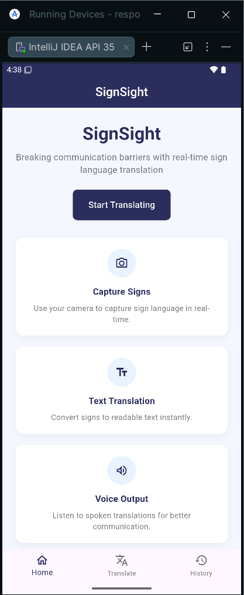
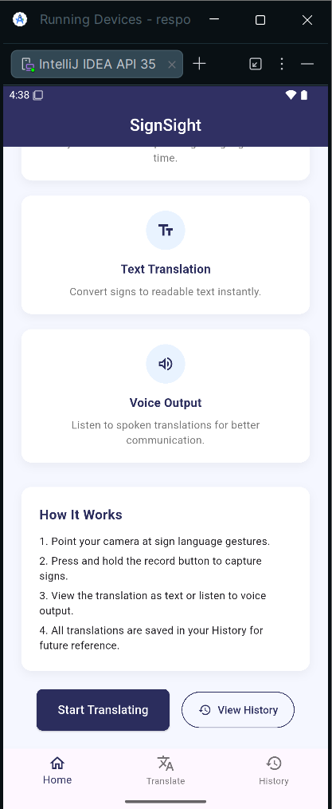
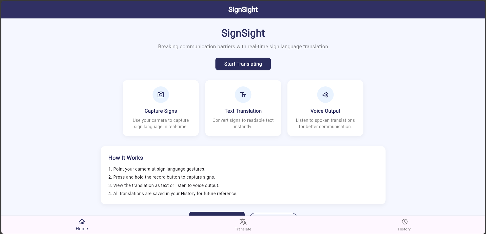

SignSight – Real-Time Sign Language Translation UI (Flutter Web Responsive)

SignSight is a responsive Flutter UI designed to simulate a real-time sign language translation platform. The interface focuses on accessibility, clarity, and modern SaaS-style design, providing users with an intuitive experience for translating sign language into readable text and voice output.

This project was built using Flutter with responsive layout techniques to ensure smooth performance across Web, Android, and iOS screen sizes. The UI includes a structured navigation system, feature highlight cards, and a guided “How It Works” section to improve user onboarding and usability.

The design follows a consistent color system and modern UI principles, using reusable widgets and scalable layout structures suitable for production-level applications. The goal of this project is to demonstrate clean UI architecture, responsive design handling, and real-world product interface standards using Flutter.

Main Features

Responsive Web-first Flutter layout

Clean SaaS-style modern UI

Feature cards for core functionality (Capture Signs, Text Translation, Voice Output)

Structured onboarding section (How It Works)

Reusable components for scalability

Consistent design system and color theme

Tech Stack

Flutter

Dart

Material UI Components

Responsive Layout (Wrap, LayoutBuilder, Constraints)

